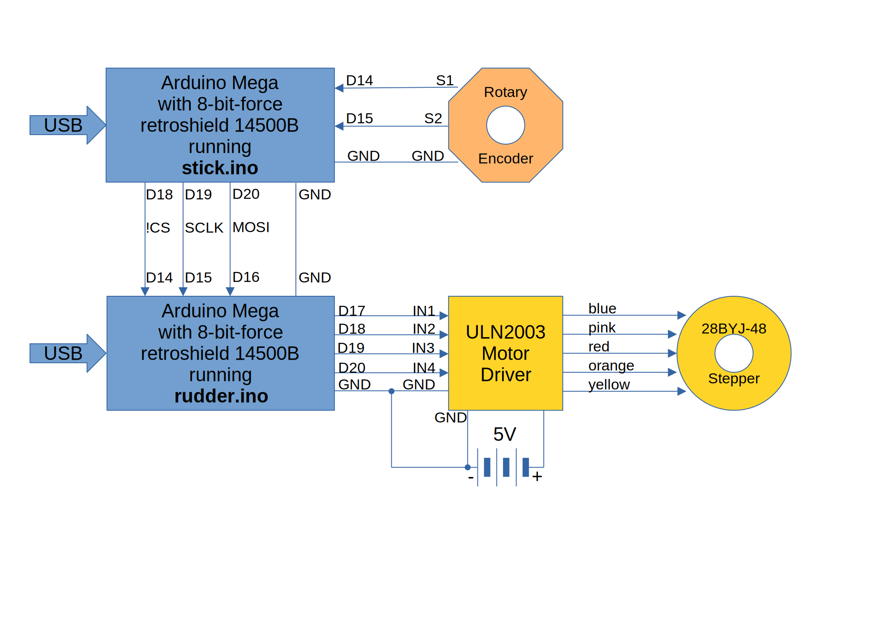

# Stick and Rudder

How to fly-by-wire when all you have is 1 bit?

**Note**: don't try it outside your living room.

## Concept

The stick program reads the rotary encoder, and when a clockwise or a counter-clockwise rotation is detected, a bit-banged SPI message is sent to the rudder program. The rudder program interprets the message and translates it to signals for the connected stepper motor to move three steps in the direction indicated by the received SPI message.

## Hardware Setup

### Block Diagram

**Note** Do not power the stepper motor (stepper motor driver module) from the Arduino's 5V output. Please, provide an independent 5V source capable of delivering at least 500\[mA\].

### BOM

- 2x [Arduino Mega 2560](https://store.arduino.cc/en-nl/products/arduino-mega-2560-rev3).

  

- 2x [8-Bit-Force](https://www.tindie.com/stores/8bitforce/) [Retroshield 14500B Rev B](https://www.tindie.com/products/8bitforce/retroshield-14500-for-arduino-mega/).

  

- 1x `EC11` rotary encoder module with built-in pull-up resistors and an RC filter.

  

- 1x `28BYJ-48` 5V unipolar stepper motor with `ULN2003` Motor Controler module.

  

### Detailed Schematics

Suppose you have a problem acquiring the rotary encoder module and the stepper motor controller modules. The following KiCad 8 generated schematic shows a reverse-engineered internal diagram of the EC11 rotary encoder and the ULN2003 motor driver modules.

## Software

- The [k14500b_stick/Stick.ino](k14500b_stick/k14500b_stick.ino) program runs on the arduino module connected to the `EC11` rotary encoder module.

- The [k14500b_rudder/Rudder.ino](k14500b_rudder/k14500b_rudder.ino) program runs on the arduino module connected to the `ULN2003` Motor Driver module.

- The [firmware/sbc1/stick.s](firmware/sbc1/stick.s) is the source code for the `MC14500B` program defined in [k14500b_stick/memorymap.h](k14500b_stick/memorymap.h). 

- The [firmware/sbc1/rudder.s](firmware/sbc1/rudder.s) is the source code for the `MC14500B` program defined in [k14500b_rudder/memorymap.h](k14500b_rudder/memorymap.h). 
