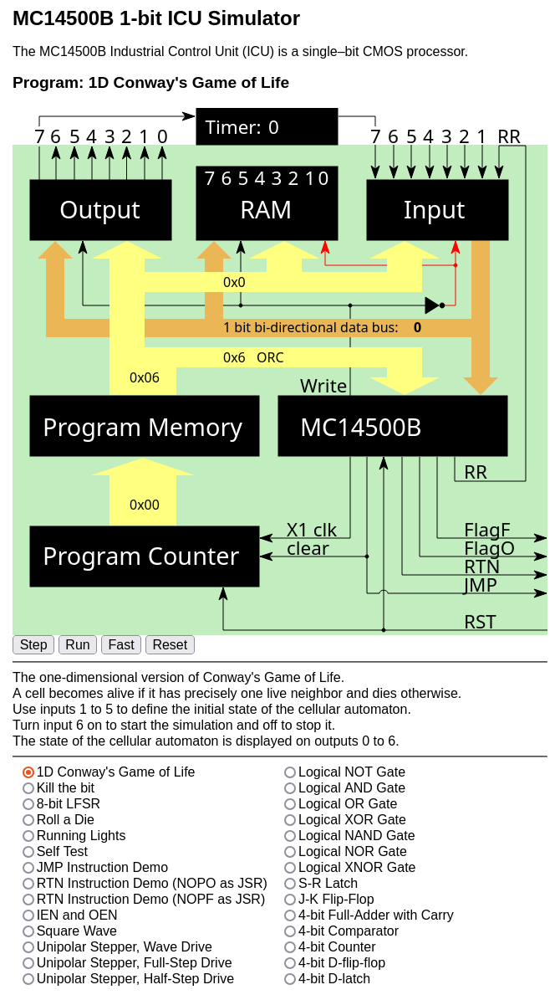

# MC14500 Projects

## MC14500 Assembler and Disassembler

This project modernizes an old [MC 14500B Assembler and Disasembler](https://www.linurs.org/download/mc14500-0.4.tar.gz) initially written by [Urs Lindegger](https://www.linurs.org/).

The lastes version Usr published was 0.4. The current version of this project is 0.5.

### Changes and Additions

The original programs were written in Python 2, which was the right choice for 2010 but is no longer supported. The first task was to port them to Python 3 so they would be usable on modern OSs. In addition, I extended the functionality somewhat. They were tested on Mac OSX and Linux but are expected to work on Windows without modifications. The minimal required Python version is 3.10.

### The Overal Project Structure

- [mc14500.py](mc14500-asm/mc14500.py) is the assembler.

- [mc14500dis.py](mc14500-asm/mc14500dis.py) is the disassembler.

- [mc14500util.py](mc14500-asm/mc14500util.py) contains declarations and functions shared between assembler and disassembler

- [exmaples](mc14500-asm/examples) the directory with sample programs described later in this file.

- [examples/Makefile](mc14500-asm/examples/Makefile) is the makefile that assembles, and disassembles all provided examples. It is expected to be run from [examples](mc14500-asm/examples) directory and supports the following targets:

  ```
  make clean
  ```

  removes all assembler and disassembler artefacts in example projects

  ```
  make build
  ```

  recursivly invokes assembler in each [exmaples/](mc14500-asm/examples) subfolder and produces all supported assembler artefacts. Then it invokes disassembler on appropirate assembler artefact to produce approporiate `*.dis` filses.

  ```
  make pack
  ```

  packages the content of `mc14500-asm` directory and subdirectories into `mc14500-0.5.tar.gz` for redistribution.

  ```
  make all
  ```

  is the equivalent of `make clean build pack`

- [examples/Makefile.mk](mc14500-asm/examples/Makefile.mk) contains definition on subtargets

- each example subdirectory contains its own `Makefile` that defines the concrete build targets for this example.

- [examples/include](mc14500-asm/examples/include) directory contains some few assembler files that can be included in other assembler files and that define the common mnemonics to use for input, output and ram locations. Those files are taken directly from Urs examples. The inclusion mechanism and mnemonics declarations will be described later in a chapter on `mc14500.py` assembler program.

- [exmples/mif-parsr-test](mc14500-asm/examples/mif-parser-test) is odd man out subdirectory, for testing the MIF format parser used by `mc14500dis.py`. More about it later in a chapter on `mc14500dis.py` disassembler program.

The makefile can be invoked with following additional arguments that will be passed to `mc14500.py`:

- `MEM_WIDTH=<memory-width>`, where *memory-widht* is the width of MC14500 ROM memory. The acceptable values are `8`, `12` or `16`. The default value is `8`.

- `INSTR_POSITION=<instruction-position>`, where *instruction-position* is the position of 4 instruction bits within the MC14500 ROM address location. The acceptable acceptable values are `first` indicating that the 4 most significant bits are used to encode the MC14500B instruction, and `last` indicating that the 4 least significant bits are used to encode the MC14500B instruction. The default value is `last`.

- `NON_PROGRAMED_MEMORY=<non-programmed-memory-value>`, indicating the value to be written into memory locations that are not programmed. The allowed values are `0` or `F`. The default value is `F`.

- `DEPTH=<depth-rom-memory>`, indicating maximal number of MC14500B system ROM memory. The allowed values are any positive integer multiple of `128` up to and including `65536`. The default value is `256`.

Other prameters of assembler and disassembler are fixed by the `Makefile`.


### mc14500.py: The Simple Assembler for MC14500B MCU

`TODO describe assembler usage`

```bash
mc14500-asm/examples$ ../mc14500.py --help
usage: mc14500.py [-v] [-h] [-s] [-x] [-b] [-w width] [-d depth] [-I include_directory] [-i instr_position] [-n non_programmed_location_value] asm_file

MC14500 Assembler

positional arguments:
  asm_file              The assembler file to be processed

options:
  -h, --help            show this help message and exit
  -v, --version         show program's version number and exit
  -w {8,12,16}, --width {8,12,16}
                        The width of the ROM in bits (8, 12 or 16)
  -d DEPTH, --depth DEPTH
                        The depth of the ROM in bytes, allowed values are positive integer multiples of 128 up to and including 65536
  -i {first,last}, --instr_position {first,last}
                        Position of INS field in a command: first|last, default is last
  -I INCLUDE, --include INCLUDE
                        An additonal directory to look for include files beside the current working directory
  -s, --srec            Generate Motorola S record file
  -x, --hex             Generate HEX file
  -b, --binary          Generate faw binary file
  -n {0,F}, --non_programmed_location_value {0,F}
                        The value that is expected to be present in ROM locations that are not part of program
```


### mc14500dis.py: The Simple Disassembler for MC14500B MCU

`TODO describbe disassembler usage`

```bash
mc14500-asm/examples$ ../mc14500dis.py --help
usage: mc14500dis.py [-v] [-h] [-w width] [-i instr_position] [-o output_file] input_file

MC14500 Disassembler

positional arguments:
  input_file            Input file in srec, hex or bin format

options:
  -h, --help            show this help message and exit
  -o OUT, --out OUT     Output file, default is input file name with .dis extension
  -v, --version         show program's version number and exit
  -w {8,12,16}, --width {8,12,16}
                        The width of the ROM in bits (8 or 16), required for hex and bin input file format
  -i {first,last}, --instr_position {first,last}
                        Position of INS field in command: first|last, default is last
```

## MC14500 Simulator

This project modernizes another MC14500-related program, also originally written by
[Urs Lindegger](https://www.linurs.org/), a [MC 14500B Simulator](https://www.linurs.org/index.html).

### Changes and Additions

- It uses a modern JavaScript module system to simplify debugging, modifying, and extending code.

- Adds timer to the simulated MC14500 system. The timer is triggered by output 7, and its output is linked to input 7.

- Program counter wraps around after 256 instructions.

- Adds demo programs, e.g., One Dimension Conway's Game of Life, Kill the Bit, etc.

- Adds the possibility of choosing the program on the fly.

- Defines the API that a demo program can use to customize the simulator behavior:

    - To make the visualization more effective, a selected program can set the simulation clock speed in the fast mode.

    - The selected program can set the timer interval in milliseconds. The maximal timer interval is 100,0000 ms.

    - The selected program can output a short description and usage instructions.

- Added support for external lookup table and LIFO ram (to be combined by `JMP`, `NOPO`, `NOPF` and `RET`) instructions to
  implment `go to` and `subroutine` calls. See `MC14500B Industrial Control Unit Handbook` Chapter 12 Adding Jumps, Conditional Branches, And Subroutines. The link to bitsavers version of the document is provided in [MC14500 Resources](#mc14500-resources) section.

### Simulator Structure

- [index.html](mc14500-sim/index.html) - The HTML file that loads the simulator. The background image visualizes a minimal
  MC14500 system having eight inputs, eight outputs, 8-bit internal scratch RAM, and 256-byte ROM is defined as an embedded SVG
  document. It can be accessed and manipulated using JavaScript.

- [mc14500.js](mc14500-sim/mc14500.js) - The javascript file that implements the MC14500 simulator.

- [programs.js](mc14500-sim/programs.js) - The javascript file that hooks to the MC14500 simulator with a program repository. It provides
  a list of programs that the simulator can run, handles the program selection, and loads the selected program
  into the simulator.

- [programs](mc14500-sim/programs) - Directory containing the MC14500 programs repository.

## MC14500 Resources

The following related resources were available on 2024-10-21 and may not be available when you read this:

- [MC14500B Wikipedia Article](https://en.wikipedia.org/wiki/Motorola_MC14500B)

- [MC14500B Datasheet](https://bitsavers.org/components/motorola/14500/MC14500B_Rev3.pdf)

- [MC14500B Industrial Control Unit Handbook](https://bitsavers.org/components/motorola/14500/MC14500B_Industrial_Control_Unit_Handbook_1977.pdf)

- alternative from [archive.org](https://web.archive.org/web/20220220062727/http://bitsavers.org/components/motorola/14500/MC14500B_Industrial_Control_Unit_Handbook_1977.pdf)

- 1978 [Motorola CMOS Integrated Circuits](https://bitsavers.org/components/motorola/_dataBooks/1978_Motorola_CMOS_Data_Book.pdf) Data Book page 358

- [MC14500B Simulator](https://www.linurs.org/index.html)

- Yaroslav Veremenko's GitHub page [mc14500-programs](https://github.com/veremenko-y/mc14500-programs)

## MC14500 Demo Programs

All programs come in 2 flaworus:

- The assembler version in an appropiratee subdirectory of [mc14500-asm/examples/](mc14500-asm/examples).

- The assembler output addopted for a simulator in [mc14500-sim/projects/](mc14500-sim/programs).

The most interesting demo programs are:

### One Dimension Conway's Game of Life

- [Assembler](mc14500-asm/examples/1d-conways-gol/1d-conways-gol.asm)

- [Simmualtor](mc14500-sim/programs/1d_conways_gol.js)

#### Game Rules

- A cell is born if it has precisely one live neighbor.

- A cell dies if it has zero or two live neighbors.

- The world consists of 7 cells (0..6).

- The world is cyclic, i.e., the first cell is a neighbor of the last cell.

- The initial state can be defined by the state of 5 middle cells (1..6). The initial state of the first and the
  last cell is always dead.

#### Why The Choices Described Above

- The physical limitation of the MC14500 system it targets is only 8 bits of RAM.

- It would be possible to design the program to set the initial state of all seven cells. However, if the
  initial state of one automaton corresponds to any other automaton's internal state, those two automatons are
  equivalent. It would only make a program more complex but not allow new behavior.

- Initial cells are defined in the middle of the world. The emulated world is cyclic, but our perception of the
  visualization is not. This choice does not yield any new behavior but makes the generated states' symmetry more
  apparent to the human eye.

#### Program Description

- The cellular automaton state is represented in scratch RAM locations 0 to 7. The state of the cell is stored in the
  corresponding bit of the scratch RAM location. For example, the state of cell 0 is stored in bit 0 of the
  scratch RAM location 0, the state of cell one is stored in bit 1 of the scratch RAM location 0, and so on.

- Inputs 1 to 5 define the initial state. Input 1 corresponds to the scratch RAM location 1; input 2 corresponds to
  scratch RAM location 2, and so on. If the input number is rendered black, its value is 0, and the associated cell is
  dead. If the input number is rendered red, its value is 1, and the associated cell is alive.

- The initial state can be changed by clicking on inputs 1 to 5 as long as input 6 is black (value 0 means that the
  simulation is stopped).

- The initial state is copied to the scratch RAM locations 0 to 4 and the outputs 0 to 4.

- Clicking on the input 6 starts the simulation. The simulation runs until you click on input six again to stop it.

- Outputs 0 to 4 show the current state of the cellular automaton; the outputs 5 to 7 are not used and set to 0.

- After each simulation run, the state of the cellular automaton is copied from the RAM locations 0 to 4 to the
  outputs 0 to 4.

#### Simmulator Instructions

1. Open the [index.html](mc14500-sim/index.html) file in a browser.

   

2. Click the 'Fast' button to run the emulator in the fast mode for better visual effects.

3. Click on the 'Run' button to start the program.

   

4. Define the initial state by clicking on inputs 1 to 5. If the input number is red, its value is 1, and the associated
   cell is alive. If the input number is black, its value is 0, and the associated cell is dead. In the example below, the
   initial state is defined as 10001. Note that input 6 is black, indicating that the simulation has stopped and that you can
   change the initial state.

   

5. Start the simulation by clicking on the input 6. If it is red, the simulation is running. If it is black, the
   simulation is stopped, and you can change the initial state. In the example below, the current state of the cellular
   automaton is 110011. Note that input six is read, indicating that the simulation is running.

   

#### How the Program Works

Three bits of the internal state are required to calculate the next state. As we have only 8 bits available, and
the internal state requires 7 bits, the last two bits of the internal state that would typically be held in RAM5 and RAM6
are made implicit using the following strategy:

- The program is divided into four similar sections:

- Depending on the state of RAM5 or RAM6, the section has inputs or outputs either enabled or disabled.
  If it has inputs and outputs enabled, its code can implicitly consider the state of RAM5 and RAM6 and is free to use
  those registers as temporary storage for calculating the new state. At the end of the calculation, RAM5 and RAM6 are
  set to the latest state, and the section is marked as done by setting the RAM7 to 1, indicating that the calculation
  has been performed, and the following sections will have inputs and output disabled.

- Section 1 calculates the next state if RAM bits 5 and 6 are 0.

- Section 2 calculates the next state if RAM bit 5 is 0 and bit 6 is 1.

- Section 3 calculates the next state if RAM bit 5 is 1 and bit 6 is 0.

- Section 4 calculates the next state if RAM bits 5 and 6 are 1.

- For readability purposes, the algorithm describing the calculation of the following state uses the following notation:
    - `a` denotes a state of bit 0, initially and finally in RAM0.
    - `b` denotes a state of bit 1, initially and finally in RAM1.
    - `c` denotes a state of bit 2, initially and finally in RAM2.
    - `d` denotes a state of bit 3, initially and finally in RAM3.
    - `e` denotes a state of bit 4, initially and finally in RAM4.
    - `f` denotes a state of bit 5, initially and finally in RAM5.
    - `g` denotes a state of bit 7, initially and finally in RAM6.
    - `x` denotes don't care.
    - `1` or 0 denotes the constant value in a given RAM bit.
    - A bit's new (changed) state is denoted using `a'`, `b'`, and so on.
    - For example:
        - The sequence `a b c d e b 0 x` is interpreted as `a` in RAM0, `b` in RAM1, `c` in RAM2, `d` in RAM3,
          `e` in RAM4, `b` in RAM5, `0` in RAM6. `x` in RAM7 means `don't care.`
        - The transformation `a'b'c d e c b a -> a'b'c'd e c b a, c'=b^d` is interpreted as the change of the state
          of c in RAM2 to `c'`, by EXORing the previous state of `b` in RAM6 with the current state of `d` in RAM3.
          The following illustrates the calculation of the following state for the section 1:
    - The initial state is `a b c d e 0 0 x`.
    - `a b c d e 0 0 x -> a b c d e a a a`
    - `a b c d e a a a -> a'b c d e a a a, a'=b^g=b^0=b`
    - `a'b c d e a a a -> a'b c d e b b a`
    - `a'b c d e b b a -> a'b'c d e b b a, b'=a^c`
    - `a'b'c d e b b a -> a'b'c d e c b a`
    - `a'b'c d e c b a -> a'b'c'd e c b a, c'=b^d`
    - `a'b'c'd e c b a -> a'b'c'd e c d a`
    - `a'b'c'd e c d a -> a'b'c'd'e c d a, d'=c^e`
    - `a'b'c'd'e c d a -> a'b'c'd'e e d a`
    - `a'b'c'd'e e d a -> a'b'c'd'e'e d a, e'=d^f=d^0=d`
    - `a'b'c'd'e'e d a -> a'b'c'd'e'f'd a, f'=e^g=e^0=e -> NOOP`
    - `a'b'c'd'e'f'd a -> a'b'c'd'e'f'g'a, g'=f^a=0^a=a`

- Other sections differ in the 2nd and the last 3 steps.

### Kill the bit

This is the port of `Kill the Bit` game for Altair by Dean McDaniel, May 15, 1975.
Reference:

- https://altairclone.com/downloads/killbits.pdf

The idea to implement it on the MC14500 came to me after watching the demonstration of the original game on the Altair 8800
replica:

- https://www.youtube.com/watch?v=ZKeiQ8e18QY

and the following video by Usagi Electric:

- https://www.youtube.com/watch?v=md_cPxVDqeM

The implementation was somewhat influenced by Yaroslav Veremenko's:

- https://github.com/veremenko-y/mc14500-programs/blob/main/sbc1/killthebit.s

and Nikola Cimino's:

- https://github.com/nicolacimmino/PLC-14500/blob/master/tools/assembler/examples/killthebit.asm

#### Program Description

The game objective is to kill the rotating bit (`OUT1`-`OUT6`). If you miss the lit bit, another bit turns on, leaving
two bits to destroy. Quickly toggle the correct switch (`IN1`-`IN6`) at the right moment. Don't leave the switch in the
ON position, or the game will pause till you turn it OFF.

- [Assembler](mc14500-asm/examples/killthebit/killthebit.asm)

- [Simmulator](mc14500-sim/programs/killthebit.js)

  

### 8-bit LFSR

- [Assembler](mc14500-asm/examples/8-bit-lfsr/8-bit-lfsr.asm)

- [Simmulator](mc14500-sim/programs/8_bit_lfsr.js)

This program implements an 8-bit Linear Feedback Shift Register (LFSR) with maximum length feedback using the
polynomial

```
x^8 + x^6 + x^5 + x^4 + 1
```

#### Rules for Selecting Feedback Polynomial:

- The 'one' in the polynomial corresponds to input to the first bit.
- The powers of polynomial term represent tapped bits, counting from the left,  e.g., for the 8-bit shift register,
  the power 8 represents the MSB, and the power 1 represents the LSB.
- The first and last bits are always connected by an input and output tap.
- The maximum length can only be possible if the number of taps is even and there is no common divisor for all taps.

#### Usage:

- Set `IN5` ON, `IN6` OFF to load `IN1`-`IN4` into `RAM0`-`RAM3` (the initial values `X0`-`X3`)
- Set `IN5` OFF, `IN6` OFF to load `IN1`-`IN4` into `RAM4`-`RAM7` (the initial values `X4`-`X7`)
- Set `IN6` ON to generate a pseudorandom sequence on output `OUT0`.
- `OUT1` is the write signal. It switches from `0` to `1` when the `OUT0` value is updated, and back from `1` to `0` at
  the beginning of a program cycle.


#### Additional References

- Wikipedia article [Linear-feedback shift register](https://en.wikipedia.org/wiki/Linear-feedback_shift_register).

- Wikipedia article [Maximum length sequence](https://en.wikipedia.org/wiki/Maximum_length_sequence).

- Clive “Max” Maxfield's EE Times Tutorial: Linear Feedback Shift Registers (LFSRs)

  - [Part 1](https://www.eetimes.com/tutorial-linear-feedback-shift-registers-lfsrs-part-1/),

  - [Part 2](https://www.eetimes.com/tutorial-linear-feedback-shift-registers-lfsrs-part-2/),

  - [Part 3](https://www.eetimes.com/tutorial-linear-feedback-shift-registers-lfsrs-part-3/).

### Other Demo Programs

Most of the other provided demo programs are taken from the book [MC14500B Industrial Control Unit Handbook](https://bitsavers.org/components/motorola/14500/MC14500B_Industrial_Control_Unit_Handbook_1977.pdf)
or adapted from the programs provided to the original [MC14500B Simulator](https://www.linurs.org/index.html).

- Roll a Die: This program generates a random number between 1 and 6.

  - [Assembler](mc14500-asm/examples/roll-a-die/roll-a-die.asm),

  - [Simulator](mc14500-sim/programs/roll_a_die.js).

- Running Lights: This program simulates a running light effect like a Christmas tree decoration. It is adapted from Urs Lindegger's collection.

  - [Assembler](mc14500-asm/examples/runninglight/runninglight.asm),

  - [Simulator](mc14500-sim/programs/running_lights.js).

- Self Test: A simple program to exercise all parts of the emulator. Inspired by Nikola Cimino's program [PLC-14500 Smoketest2](https://github.com/nicolacimmino/PLC-14500/blob/master/tools/assembler/examples/smoketest2.asm).

  - [Assembler](mc14500-asm/examples/selftest/selftest.asm),

  - [Simulator](mc14500-sim/programs/selftest.js).

- `JMP` Instruction Demo: This is a simple program that demonstrates, with some addtional hardware, a 16 byte ROM as a lookup  table, it is possible to how to use `JMP` instruction to implement `GOTO` functionality. This sample requires hardware
  modification (see simulator).

  - [Assembler](mc14500-asm/examples/jmp/jmp.asm),

  - [Simmulator](mc14500-sim/programs/jmp.js).

- `RTN` Instruction Demo: This is a simple program that demonstrates how using additional hardware, a 16 byte ROM as `JSR`
   lookup table and a 16 byte LIFO as a stack, it is possible to implement subroutine calls. This sample requires hardware
   modification (see simulator).

  - [Assembler](mc14500-asm/examples/rtn/rtn_nopo.asm) uses `NOPO` instruction as `JSR`,

  - [Assembler](mc14500-asm/examples/rtn/rtn_nopo.asm) uses `NOPF` instruction as `JSR`,

  - [Assembler](mc14500-asm/examples/rtn/rtn_jsr.asm) shows how `EQU` directive can be used to define
    the pseudo instruction `JSR` and link it to the real `NOPO` instruction to make the code more readable,

  - [Simmulator](mc14500-sim/programs/rtn_nopo.js) uses `NOPO` instruction as `JSR`,

  - [Simmulator](mc14500-sim/programs/rtn_nopf.js) uses `NOPF` instruction as `JSR`.

- `IEN` and `OEN`: This is a simple program that demonstrates how `IEN` and `OEN` instruction modify
  the behavior of `LD`, `LDC`, `STO`, and `STOC` instructions.

  - [Assembler](mc14500-asm/examples/ien-oen/ien-oen.asm),

  - [Simmulator](mc14500-sim/programs/ien_oen.js).

- Square Wave: This program generates a square wave on the output OUT4. It is taken from Urs Lindegger's collection.

  - [Assembler](mc14500-asm/examples/square/square.asm),

  - [Simmulator](mc14500-sim/programs/square.js).

- Example RAM Usage: A simple program to illustrate how to use RAM to evaluate a boolean equation:
  `Z = (A ∧ B) ∨ (C ∧ D)`. It is taken from Urs Lindegger's collection.

  - [Assembler](mc14500-asm/examples/ramtest/ramtest.asm),

  - [Simmulator](mc14500-sim/programs/ramtest.js).

- Unipolar Stepper, Wave Drive: This program drives a unipolar stepper motor using a wave drive.

  - [Assembler - rotation in clockwise direction](mc14500-asm/examples/stepper/cw_wave.asm),

  - [Assembler - rotation in counter-clockwise direction](mc14500-asm/examples/stepper/ccw_wave.asm),

  - [Simmulator - rotation in clockwise direction](mc14500-sim/programs/stepper_cw_wave.js).

- Unipolar Stepper, Full Step Drive: This program drives a unipolar stepper motor using a full-step drive.

  - [Assembler - rotation in clockwise direction](mc14500-asm/examples/stepper/cw_full_step.asm),

  - [Assembler - rotation in counter-clockwise direction](mc14500-asm/examples/stepper/ccw_full_step.asm),

  - [Simmulator - rotation in clockwise direction](mc14500-sim/programs/stepper_cw_full_step.js).

- Unipolar Stepper, Half Step: This program drives a unipolar stepper motor using a half-step drive.

  - [Assembler - rotation in clockwise direction](mc14500-asm/examples/stepper/cw_half_step.asm),

  - [Assembler - rotation in counter-clockwise direction](mc14500-asm/examples/stepper/ccw_half_step.asm),

  - [Simmulator - rotation in clockwise direction](mc14500-sim/programs/stepper_cw_half_step.js).

- Logical NOT Gate: This program demonstrates implementing the logical NOT gate using MC14500B assembler code.
  It is adapted from MC14500B Industrial Control Unit Handbook.

  - [Assembler](mc14500-asm/examples/not/not.asm),

  - [Symmulator](mc14500-sim/programs/not.js).

- Logical AND Gate: This program demonstrates implementing the logical AND gate using MC14500B assembler code.
  It is adapted from MC14500B Industrial Control Unit Handbook.

  - [Assembler](mc14500-asm/examples/and/and.asm),

  - [Symmulator](mc14500-sim/programs/and.js).

- Logical OR Gate: This program demonstrates implementing the logical OR gate using MC14500B assembler code.
  It is adapted from MC14500B Industrial Control Unit Handbook.

  - [Assembler](mc14500-asm/examples/or/or.asm),

  - [Symmulator](mc14500-sim/programs/or.js).

- Logical XOR Gate: This program demonstrates implementing the logical XOR gate using MC14500B assembler code.
  It is adapted from MC14500B Industrial Control Unit Handbook.

  - [Assembler](mc14500-asm/examples/xor/xor.asm),

  - [Symmulator](mc14500-sim/programs/xor.js).

- Logical NAND Gate: This program demonstrates implementing the logical NAND gate using MC14500B assembler code.
  It is adapted from MC14500B Industrial Control Unit Handbook.

  - [Assembler](mc14500-asm/examples/nand/nand.asm),

  - [Symmulator](mc14500-sim/programs/nand.js).

- Logical NOR Gate: This program demonstrates implementing the logical NOR gate using MC14500B assembler code.
  It is adapted from MC14500B Industrial Control Unit Handbook.

  - [Assembler](mc14500-asm/examples/nor/nor.asm),

  - [Symmulator](mc14500-sim/programs/nor.js).

- Logical XNOR Gate: This program demonstrates implementing the logical XNOR gate using MC14500B assembler code.
  It is adapted from MC14500B Industrial Control Unit Handbook.

  - [Assembler](mc14500-asm/examples/xnor/xnor.asm),

  - [Symmulator](mc14500-sim/programs/xnor.js).

- S-R Latch: This program demonstrates implementing the S-R Latch gate using MC14500B assembler code.
  It is adapted from MC14500B Industrial Control Unit Handbook.

  - [Assembler](mc14500-asm/examples/latch/1-bit-sr-latch.asm),

  - [Symmulator](mc14500-sim/programs/1_bit_sr_latch.js).

- J-K Flip-Flop: This program demonstrates implementing the J-K Flip-Flop gate using MC14500B assembler code.
  It is adapted from MC14500B Industrial Control Unit Handbook.

  - [Assembler](mc14500-asm/examples/latch/1-bit-jk-flip-flop.asm),

  - [Symmulator](mc14500-sim/programs/1_bit_jk_flip_flop.js).

- 4-bit Full Adder with Carry: This program demonstrates implementing the 4-bit full-adder
  with carry circuit using MC14500B assembler code. It combines several sample routines from MC14500B Industrial Control Unit Handbook into a sample program.

  - [Assembler](mc14500-asm/examples/4-bit-adder/4-bit-adder.asm),

  - [Symmulator](mc14500-sim/programs/4_bit_adder.js).

- 4-bit Comparator: This program demonstrates implementing the 4-bit Comparator circuit using MC14500B assembler code.
  It combines several sample routines from MC14500B Industrial Control Unit Handbook into a sample program.

  - [Assembler](mc14500-asm/examples/4-bit-comparator/4-bit-comparator.asm),

  - [Symmulator](mc14500-sim/programs/4_bit_comparator.js).

- 4-bit Counter: This program demonstrates implementing the 4-bit Counter circuit using MC14500B assembler code.

  - [Assembler](mc14500-asm/examples/4-bit-counter/4-bit-counter.asm),

  - [Symmulator](mc14500-sim/programs/4_bit_counter.js).

- 4-bit D-Flip-Flop: This program simulates a 4-bit D-flip-flop circuit using MC14500B assembler code.

  - [Assembler](mc14500-asm/examples/latch/4-bit-latch.asm),

  - [Symmulator](mc14500-sim/programs/4_bit_counter.js).

- 4-bit D-Latch: This program simulates a 4-bit D-latch circuit using MC14500B assembler code.

   For a discussion of the difference between a flip-flop and a latch, please check this Wikipedia resource [Flip-flop (electronics)](https://en.wikipedia.org/wiki/Flip-flop_(electronics)). Generally, modern authors reserve the term flip-flop exclusively for edge-triggered storage elements and latches for level-triggered ones.

   When a level-triggered latch is enabled, it becomes transparent, but an edge-triggered flip-flop's output only changes on a clock edge (either positive or negative going).

  - [Assembler](mc14500-asm/examples/latch/4-bit-d-flip-flop.asm),

  - [Symmulator](mc14500-sim/programs/4_bit_d_flip_flop.js).

- MIF parser test - test samples used while developing MIF parser used in [mc14500dis.py](mc14500-asm/mc14500dis.py).

  - [Assembler](mc14500-asm/examples/mif-parser-test)

- ORG tests - test samples to validate if [mc14500.py](mc14500-asm/mc14500.py) assembler is processing ORG directive correctly.

  - [Assembler](mc14500-asm/examples/org)
