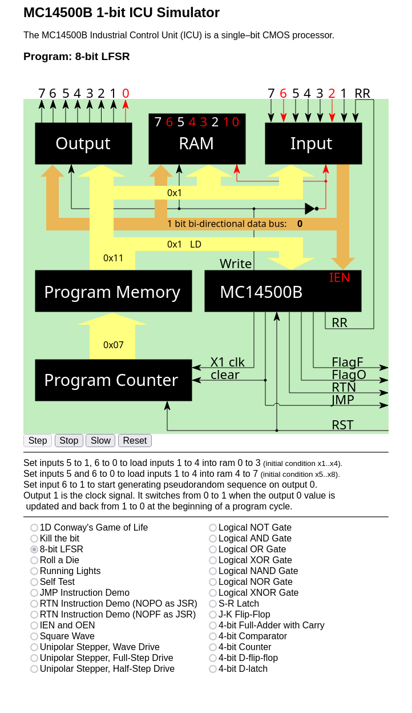

# MC14500 Projects

- [MC14500 Resources](#mc14500-resources)

- [MC14500 Assembler and Disassembler](#mc14500-assembler-and-disassembler)

- [MC14500 Simulator](#mc14500-simulator)

- [MC14500 Demo Programs](#mc14500-demo-programs)

- `github.io` [docs](https://dmalenic.github.io/mc14500b/).

The MC14500 is an Industrial Control Unit (ICU) that is also considered to be a 1-bit processor. It was produced by
Motorola, but the production has been stopped years ago.

## MC14500 Resources

The following related resources were available on 2024-10-21 and may not be available when you read this:

- [MC14500B Datasheet](https://bitsavers.org/components/motorola/14500/MC14500B_Rev3.pdf),

- [MC14500B Industrial Control Unit Handbook](https://bitsavers.org/components/motorola/14500/MC14500B_Industrial_Control_Unit_Handbook_1977.pdf), the alternative download location [archive.org](https://web.archive.org/web/20220220062727/http://bitsavers.org/components/motorola/14500/MC14500B_Industrial_Control_Unit_Handbook_1977.pdf),

- 1978 [Motorola CMOS Integrated Circuits](https://bitsavers.org/components/motorola/_dataBooks/1978_Motorola_CMOS_Data_Book.pdf) Data Book page 358,

- [US Patent 4,153,942](https://patentimages.storage.googleapis.com/4e/ea/42/0ecdf6ebef6592/US4153942.pdf) is Motorola
  patent for an industrial control processor that describes MC14500 B's internal working,

- [MC14500B Wikipedia Article](https://en.wikipedia.org/wiki/Motorola_MC14500B),

- Urs Lindegger's [MC14500B Simulator](https://www.linurs.org/index.html),

- Yaroslav Veremenko's GitHub page [mc14500-programs](https://github.com/veremenko-y/mc14500-programs),

- Nicola Cimmino's [PLC-14500](https://github.com/nicolacimmino/PLC-14500) GitHub page.

## MC14500 Assembler and Disassembler

This project is a modernization of an old [MC 14500B Assembler and Disassembler](https://www.linurs.org/download/mc14500-0.4.tar.gz) written initially 
by [Urs Lindegger](https://www.linurs.org/).

The latest version Urs published was 0.4. This project continues with version 0.5.

### What's New

The original was written in Python 2, which was the right choice for 2010 but is no longer supported. Version 0.5 is
written in Python 3. New features are added to the assembler and disassembler. More about it later. It is tested on
Linux and MacOSX but is expected to work on Windows without modifications. Python 3.10 or newer is needed.

### The Overall Project Structure

- [mc14500.py](mc14500-asm/mc14500.py) is the assembler.

- [mc14500dis.py](mc14500-asm/mc14500dis.py) is the disassembler.

- [mc14500util.py](mc14500-asm/mc14500util.py) contains declarations and functions shared between assembler and disassembler.

- [examples](mc14500-asm/examples) the directory with example MC14500B assembler programs.

- [examples/Makefile](mc14500-asm/examples/Makefile) invokes the assembler and the disassembler on all provided MC14500B example programs.
  Run it from the [examples](mc14500-asm/examples) directory. It supports the following targets:

  ```
  make clean
  ```

  Removes artifacts produced by the previous invocations of the assembler and the disassembler from all example
  projects.

  ```
  make build
  ```

  Recursively invokes assembler in each [examples](mc14500-asm/examples) subfolder to produce all supported assembler
  artifacts. After that, it invokes the disassembler on the appropriate assembler artifact to produce the appropriate
  `*.dis` files.

  ```
  make pack
  ```

  Packages the content of `mc14500-asm` directory and subdirectories into `mc14500-0.5.tar.gz` for redistribution.

  ```
  make all
  ```

  It is the equivalent of `make clean build pack`.

- [examples/Makefile.mk](mc14500-asm/examples/Makefile.mk) defines sub-targets.

- Each example subdirectory contains its own `Makefile` defining the concrete build targets for that particular example.

- [examples/include](mc14500-asm/examples/include) contains assembler files with frequently needed declarations and code snippets that other 
  assembler files can include. The mnemonics for inputs, outputs, and RAM locations can be found there. A chapter on
  `mc14500.py` assembler program will describe the inclusion mechanism and mnemonics declarations.

- [examples/mif-parser-test](mc14500-asm/examples/mif-parser-test) holds files for testing the MIF format parser used
  by `mc14500dis.py`.

Makefile can be invoked with the following arguments that will be internally passed to `mc14500.py`:

- `MEM_WIDTH=<memory-width>`, where _memory-width_ is the width of MC14500 ROM word in bits. The acceptable values are
  `8`, `12`, or `16`. The default value is `8`.

- `INSTR_POSITION=<instruction-position>`, where _instruction-position_ is the position of 4 instruction op-code bits
  within the MC14500 ROM word. The acceptable values are `first` and `last`. `first` indicates that the 4 most 
  significant bits are used to encode the MC14500B instruction op-code, and `last` indicates that the 4 least 
  significant bits are used to encode the MC14500B instruction op-code. The default value is `last`.

- `NON_PROGRAMED_MEMORY=<non-programmed-memory-value>`, indicating the value to be written into memory locations that
  are not programmed. The allowed values are `0` or `F`. The default value is `F`.

- `DEPTH=<depth-of-rom-memory>`, indicates the maximal size of MC14500B system ROM memory measured in ROM memory words.
  The allowed value is any positive integer multiple of `128` up to and including `65536`. The default value is `256`.

`Makefile` does not allow changing other parameters of the assembler and disassembler from a command line.

### mc14500.py: The Simple Assembler for MC14500B MCU

#### Synopsis

```bash
usage: mc14500.py [-h] [-v] [-w {8,12,16}] [-d DEPTH] [-i {first,last}] [-I INCLUDE] [-s] [-x] [-a] [-b] [-n {0,F}] input_file

MC14500 Assembler

positional arguments:
  input_file            the input assembler file to be processed

options:
  -h, --help            show this help message and exit
  -v, --version         show program's version number and exit
  -w {8,12,16}, --width {8,12,16}
                        the width of the ROM in bits (8, 12 or 16). The default value is 8.
  -d DEPTH, --depth DEPTH
                        the depth of the ROM in bytes, allowed values are positive integer multiples of 128 up to and including 65536. The default value is 256.
  -i {first,last}, --instr-position {first,last}
                        the position of INS field in a command: first|last. The default value is last.
  -I INCLUDE, --include INCLUDE
                        an additonal directory to look for include files beside the current working directory
  -s, --srec            generate Motorola S-record file (extension .srec)
  -x, --hex             generate Intel I8HEX file (extension .hex)
  -a, --ascii_hex       generate ASCII HEX file (extension .ascii_hex)
  -b, --binary          generate raw binary file (extension .bin)
  -n {0,F}, --non-programmed-location-value {0,F}
                        the value that is expected to be present in ROM locations that are not part of program
```

#### Description

The `mc14500.py` is the MC14500B assembler written in Python 3. It takes an input file as the argument and, if no error
has been encountered, creates at least 3 output files. The names of created output files are derived from the name of
the input file with the extension replaced:

- The listing file shows a generated machine code for every assembler instruction from the input file. It has the `.lst`
  extension.

- The io-map file lists, for every referenced io-address space location, how many times this location was accessed by
  the instructions that read the value (`LD`, `LDC`, `AND`, `ANDC`, `OR`, `ORC`, `XNOR`, `IEN`, `OEN`), by the
  instructions that write the value (`STO`, `STOC`), or by the instructions that do neither (`NOPO`, `JMP`, `RET`,
  `SKZ`, `NOPF`). It has `.map` extension.

- The memory initialization file (MIF) contains assembled machine code. It has `.mif` extension. More information on MIF
  format can be found at:

    - [Memory Initialization File](https://mil.ufl.edu/4712/docs/mif_help.pdf),

    - Intel Quartus Prime [Memory Initialization File (.mif) Definition](https://www.intel.com/content/www/us/en/programmable/quartushelp/current/index.htm#reference/glossary/def_mif.htm),

    - Linux man page for [srec_mif](https://linux.die.net/man/5/srec_mif).

The `.asm` extension for the input file is recommended but not mandatory. Any extension except the extensions reserved
for the various output files can be used. The produced output files share the same base name as the input file, but the
extension has been replaced.

If one or more errors are encountered, error messages are written to `stderr`. OOnly the listing file is produced,
containing the exact error messages written to `stderr`. The program exit value is 1.

#### Options

- `a`, `--ascii_hex` output assembled machine code in ASCII HEX format. The output file has `.ascii_hex` extension.

- `-b`, `--binary` output assembled machine code in a raw binary format. The output file has `.bin` extension.

- `-d DEPTH`, `--depth DEPTH` is the depth of program ROM in words, i.e., the maximal MC14500 instructions for an
  assembled program. Allowed values are all positive multiples of 128 up to and including 65536. The default value
  is 256.

- `-h`, `--help` show the program help information, and exit.

- `-I include-file-name`, `--include include-file-name` the additional directory to scan for include files besides the
  current working directory.

- `-i {first, last}`, `--instr-position {first, last}` defines the position of the 4 instruction op-code bits within
  the assembled machine code word. The value `first` indicates that the 4 most-significant bits are used to encode the
  MC14500B instruction op-code, and the value `last` indicates that the 4 least-significant bits are used to encode
  the MC14500B instruction op-code. The default value is `last`.

- `-n {0,F}`, `--non-programmed-location-value {0,F}` defines the value for the ROM memory locations that are not
  explicitly programmed. Allowed values are `0` or `F`. This parameter is combined with the `-w` parameter to produce
  the actual value. So for 8-bit wide ROM, the value is either `00` or `FF`; for 12-bit wide ROM, the value is
  either `000` or `FFF`; and finally, for 16-bit wide ROM, the value is either `0000` or `FFFF`.

- `-s`,  `--srec` output assembled machine code using Motorola S-record format. The output file will have a `.srec`
  extension.

- `-v`, `--version` show the program version and exit.

- `-w {8, 12, 16}`, `--width {8, 12, 16}` defines the width of the program ROM word in bits. The allowed values are
  `8`, `12`, or `16`. The default value is `8`.

- `-x`, `--hex` output assembled machine code in Intel HEX format (I8HEX flavor). The output file has `.hex` extension.

Assembler Directives, Pseudo Instructions, and Numeical Constants

- `identifier EQU value` defines an _identifier_ that, if encountered later in the program, is replaced with the _value_
  before the line is converted to the machine code. The replacement logic is recursive. Recursion should terminate with
  a valid io-address declaration. It is typically used to define a symbolic name for an input, output, or RAM address,
  but it can also be used to define the instruction alias, see [rtn_jsr.asm](mc14500-asm/examples/rtn/rtn_jsr.asm).

  Numerical constants can be written using `C`, `Python` notation. Motorola `6803` assembler and `DASM` immediate
  operand syntax is also supported. See examples in [equ.asm](mc14500-asm/examples/org_and_equ_tests/equ.asm). All of
  the following numerical constants are valid representations of the number eleven: 
 `11`, `0xB`, `013`, `0o13`, `0b1011`, `#11`, `#$B`, `#013`, and `#%1011`.

- `ORG number` sets the current value of a program counter to the _number_. An attempt to write twice to the same
  program counter location results in an error. The rules to represent the _number_ as the same as the rules to define
  the _value_ part of the `EQU` directive.

- `LUT identifier number` defines an _identifier_ that, if encountered within one of the following instructions `NOPO`,
  `JMP`, `RET`, `NOPF`, the assembler will replace it with a provided _number_. The _name_ must be defined within a 
  program as a _label_. See examples in [jmp.asm](mc14500-asm/examples/jmp/jmp.asm), [rtn_jsr.asm](mc14500-asm/examples/rtn/rtn_jsr.asm), [rtn_nopf.asm](mc14500-asm/examples/rtn/rtn_nopf.asm),
  and [rtn_nopo.asm](mc14500-asm/examples/rtn/rtn_nopo.asm).

- `identifier:` an identifier followed by a column as the first word in an assembler file line defines a label.
  Labels are matched against the _identifiers_s defined by `LUT` directives, and the _identifier_ is associated with the
  program counter value at the _label_ location.

#### Lookup Table

If one or more `LUT` directives are encountered the program, for every output it produces, creates an additional
output file encoding the content of the lookup table in the same format as the original output file. The extra
output file name has a `_lut` designator before the extension. The exception is the assembler listing file `.lst`,
the lookup table is instead appended to the end of the listing file.

The lookup table size is equal to the size of the io-address space. The locations that were not explicitly defined by
`LUT` directives have the value `0`.

#### Include Functionality

Assembler supports an implicit include functionality. It may be used to simulate simple macros.

Suppose a _word_ is encountered on the 1st position in the non-comment line that is not an MC14500B instruction nor an
assembler pseudo instruction. The program will look for a file with the same name as the encountered _word_ (but
lowercased) and the extension `.asm`, first in the current directory, then in the directory specified by the `-I` or
`--include` command line argument. If such a file has been found, it is assembled, and the generated machine code is
injected into the current location.

#### Examples

The following examples assume that they are executed from [examples](mc14500-asm/examples) directory:

- The simplest usage example is

  ```bash
  ../mc14500.py -I include/ 1d-conways-gol/1d-conways-gol.asm
  ```
  It outputs the following message on the screen:
  ```bash

  MC14500 Assembler for the ICU 1-bit processor.
  Based on the original work of Urs Lindegger.
  see https://www.linurs.org/mc14500.html
  Version 0.5
  
  ROM depth: 256 [words]
  ROM width: 8 [bits]
  The 4 least significant bits are the mc14500 instruction op-code
  the other bits are the io address. This might be different
  on your hardware since it is external to the mc14500 chip.
  
  LST file:  1d-conways-gol/1d-conways-gol.lst crated
  Mif file:  1d-conways-gol/1d-conways-gol.mif created
  Map file:  1d-conways-gol/1d-conways-gol.map crated
  Assembler succeeded
  ```
  And produces following 3 files:
    - `1d-conways-gol/1d-conways-gol.lst` - the assembler listing file,
    - `1d-conways-gol/1d-conways-gol.mif` - the machine code in Memory Interchange Format,
    - `1d-conways-gol/1d-conways-gol.map` - the io-address usage mapping file.


- This example overrides default compilation arguments related to ROM size:

  ```bash
  ../mc14500.py -I include/ -n F -i first -d 512 -w 12 1d-conways-gol/1d-conways-gol.asm
  ```
  It outputs the following message on the screen:
  ```bash
  
  MC14500 Assembler for the ICU 1-bit processor.
  Based on the original work of Urs Lindegger.
  see https://www.linurs.org/mc14500.html
  Version 0.5
  
  ROM depth: 512 [words]
  ROM width: 12 [bits]
  The 4 most significant bits are the mc14500 instruction op-code
  the other bits are the io address. This might be different
  on your hardware since it is external to the mc14500 chip.
  
  LST file:  1d-conways-gol/1d-conways-gol.lst crated
  Mif file:  1d-conways-gol/1d-conways-gol.mif created
  Map file:  1d-conways-gol/1d-conways-gol.map crated
  Assembler succeeded
  ```
  Note the difference in reported ROM depth and width.

- Next is the identical example as above but using the long parameters form

  ```bash
  ../mc14500.py --include include/ --non-programmed-location-value F --instr-position first --depth 512 --width 12 1d-conways-gol/1d-conways-gol.asm
  ```
  It outputs the same message on the screen:
  ```bash
  
  MC14500 Assembler for the ICU 1-bit processor.
  Based on the original work of Urs Lindegger.
  see https://www.linurs.org/mc14500.html
  Version 0.5
  
  ROM depth: 512 [words]
  ROM width: 12 [bits]
  The 4 most significant bits are the mc14500 instruction op-code
  the other bits are the io address. This might be different
  on your hardware since it is external to the mc14500 chip.
  
  LST file:  1d-conways-gol/1d-conways-gol.lst crated
  Mif file:  1d-conways-gol/1d-conways-gol.mif created
  Map file:  1d-conways-gol/1d-conways-gol.map crated
  Assembler succeeded
  ```

- The following example requests additional `.srec`, `.hex` and `bin` outputs

  ```bash
  ../mc14500.py -I include/ -s -x -a -b 1d-conways-gol/1d-conways-gol.asm
  ```
  It outputs the following message on the screen:
  ```bash
  
  MC14500 Assembler for the ICU 1-bit processor.
  Based on the original work of Urs Lindegger.
  see https://www.linurs.org/mc14500.html
  Version 0.5
  
  ROM depth: 256 [words]
  ROM width: 8 [bits]
  The 4 least significant bits are the mc14500 instruction op-code
  the other bits are the io address. This might be different
  on your hardware since it is external to the mc14500 chip.
  
  LST file:  1d-conways-gol/1d-conways-gol.lst crated
  Mif file:  1d-conways-gol/1d-conways-gol.mif created
  SREC file:  1d-conways-gol/1d-conways-gol.srec crated
  Intel HEX file (I8HEX flavor):  1d-conways-gol/1d-conways-gol.hex crated
  Ascii hex file:  1d-conways-gol/1d-conways-gol.ascii_hex crated
  Binary file:  1d-conways-gol/1d-conways-gol.bin crated
  Map file:  1d-conways-gol/1d-conways-gol.map crated
  Assembler succeeded
  ```
  Note the 7 output files are produced:

  - `1d-conways-gol/1d-conways-gol.lst` - the assembler listing file,
  - `1d-conways-gol/1d-conways-gol.mif` - the machine code in Memory Interchange Format,
  - `1d-conways-gol/1d-conways-gol.srec` - the machine code in Motorola S-record format,
  - `1d-conways-gol/1d-conways-gol.hex` - the machine code in Intel's HEX format (I8HEX flavor),
  - `1d-conways-gol/1d-conways-gol.ascii_hex` - the machine code in ASCII HEX format,
  - `1d-conways-gol/1d-conways-gol.bin` - the machine code as raw bytes,
  - `1d-conways-gol/1d-conways-gol.map` - the io-address usage mapping file. 

### mc14500dis.py: The Simple Disassembler for MC14500B MCU

#### Synopsis

```bash
usage: mc14500dis.py [-h] [-o OUT] [-v] [-w {8,12,16}] [-i {first,last}] input_file

MC14500 Disassembler

positional arguments:
  input_file            input file nsme. Input file must have extension .mif, .srec, .hex, .ascii_hex or .bin

options:
  -h, --help            show this help message and exit
  -o OUT, --out OUT     OUT is the output file name. The default value is the input file name with appended .dis extension.
  -v, --version         show program's version number and exit
  -w {8,12,16}, --width {8,12,16}
                        the width of the ROM in bits (8, 12 or 16). It is ignored for mif files. The default vaule is 8.
  -i {first,last}, --instr-position {first,last}
                        position of INS field in a command: first|last. The default value is last.
```

#### Description

The `mc14500dis.py` is the MC14500B disassembler written in Python 3. It takes an input file as the argument and, if no
error has been encountered, creates the output files containing assembler lising. The extension of the input file
indicates the expected input file format. Following extensions are supported:

- `.mif` - the input file is a Memory Exchange Format file,

- `.srec` - the input file is Motorla SREC file,

- `.hex` - the input file is Intel HEX file in I8HEX flavor,

- `.ascii_hex` - the input file is the ASCII HEX file,

- `.bin` - the input file is raw binary file. 

If an error is encountered, it is written to `stderr` and no or partial output is produced.

#### Options

- `-h`, `--help` show the program help information, and exit.

- `-i {first, last}`, `--instr-position {first, last}` defines the position of the 4 instruction op-code bits within
  the assembled machine code word. The value `first` indicates that the 4 most-significant bits are used to encode the
  MC14500B instruction op-code, and the value `last` indicates that the 4 least-significant bits are used to encode
  the MC14500B instruction op-code. The default value is `last`.

- `-o OUT`, `--out OUT` where OUT defines the output file name. The default is the input file name with appended `.dis`
  extension.

- `-v`, `--version` show the program version and exit.

- `-w {8, 12, 16}`, `--width {8, 12, 16}` defines the width of the program ROM word in bits. The allowed values are
  `8`, `12`, or `16`. The default value is `8`. It is ignroed for `.mif` extensions.

`TODO describe disassembler usage`

## MC14500 Simulator

This project modernizes the [MC 14500B Simulator](https://www.linurs.org/mc14500sim/index.html) that is also written by 
[Urs Lindegger](https://www.linurs.org/).

### What's New

- It uses a modern JavaScript module system to simplify debugging, modifying, and extending code.

- Adds timer to the simulated MC14500-based system. The timer is triggered by output 7, and its output is linked to
  input 7.

- Program counter wraps around after 256 instructions.

- Provides multiple demo programs in a form that is ready to use by the simulator, e.g., One Dimension Conway's Game of
  Life, Kill the Bit, etc.

- All provided demo programs are directly loadable, and the simulated program can be changed on the fly without
  reloading the page.

- An API is provided for a demo program to customize the simulator behavior:

    - A selected program can influence the simulation clock speed to make the visualization more effective.

    - The selected program can specify the timer millisecond interval from 1 to the maximum allowed timer interval of
      100s (100,000 ms).

    - The demo program can display a short description and usage instructions when the program is selected.

- A simulator can simulate optional additional external hardware like a lookup table and a LIFO RAM that can be
  combined with `JMP`, `NOPO`, `NOPF`, and `RET` instructions to implement `go to` and `subroutine` calls. See
  `MC14500B Industrial Control Unit Handbook` Chapter 12 Adding Jumps, Conditional Branches, And Subroutines. The link
  to the _bitsavers_ version of the document is provided in the [MC14500 Resources](#mc14500-resources) section.

  The following example programs demonstrate those features: [jmp.js](mc14500-sim/programs/jmp.js), [rtn_nopf.js](mc14500-sim/programs/rtn_nopf.js), and [rtn_nopo.js](mc14500-sim/programs/rtn_nopo.js).

### Simulator Structure

- [index.html](mc14500-sim/index.html) - The HTML file that loads the simulator. The background image visualizes a minimal MC14500 system
  having eight inputs, eight outputs, 8-bit internal scratch RAM, and 256-byte ROM is defined as an embedded SVG
  document. It can be accessed and manipulated using JavaScript.

- [mc14500.js](mc14500-sim/mc14500.js) - The javascript file that implements the MC14500 simulator.

- [programs.js](mc14500-sim/programs.js) - The javascript file that hooks to the MC14500 simulator with a program repository. It provides
  a list of programs that the simulator can run; handles the program selection, and loads the selected program into
  the simulator.

- [programs](mc14500-sim/programs) - Directory containing the MC14500 programs repository.

## MC14500 Demo Programs

All programs come in 2 flavours:

- The assembler version in an appropriate subdirectory of [mc14500-asm/examples/](mc14500-asm/examples).

- The assembler output adopted for a simulator in [mc14500-sim/projects/](mc14500-sim/programs).

The most interesting demo programs are:

### One Dimension Conway's Game of Life

- [Assembler](mc14500-asm/examples/1d-conways-gol/1d-conways-gol.asm)

- [Simulator](mc14500-sim/programs/1d_conways_gol.js)

#### Game Rules

- A cell is born if it has precisely one live neighbor.

- A cell dies if it has zero or two live neighbors.

- The world consists of 7 cells (0..6).

- The world is cyclic, i.e., the first cell is a neighbor of the last cell.

- The initial state can be defined by the state of 5 middle cells (1..6). The initial state of the first and the last
  cells is always dead.

#### The Rationale Behind The Choices Described Above

- The physical limitation of the MC14500 system it targets is only 8 bits of RAM.

- It would be possible to design the program to set the initial state of all seven cells. However, if the initial state
  of one automaton corresponds to any other automaton's internal state, those two automatons are equivalent. It would
  only make a program more complex but not allow new behavior.

- Initial cells are defined in the middle of the world. The emulated world is cyclic, but our perception of the
  visualization is not. This choice does not yield any new behavior but makes the generated states' symmetry more
  apparent to the human eye.

#### Program Description

- The cellular automaton state is represented in RAM locations 0 to 7. The state of the cell is stored in the
  corresponding bit of the scratch RAM location. For example, the state of cell 0 is stored in bit 0 of the scratch RAM,
  the state of cell 1 is stored in bit 1 of the scratch RAM, and so on.

- Inputs 1 to 5 define the initial state. Input 1 sets or clears the RAM location 1; input 2 sets or clears RAM
  location 2, and so on. If the input number is rendered black, its value is 0, and the associated cell is dead.
  If the input number is rendered red, its value is 1, and the associated cell is alive.

- The initial state can be changed by clicking on inputs 1 to 5 as long as input 6 is zero (value 0 means that the
  simulation is stopped).

- The initial state is copied to the RAM locations 1 to 5 and the outputs 1 to 5.

- Setting the input 6 to one starts the simulation. The simulation runs until input six is on. Clearing it stops
  the simulation.

- Outputs 0 to 6 show the current state of the cellular automaton. Output 7 is not used and set to 0.

#### Simulator Instructions

1. Open the [index.html](mc14500-sim/index.html) file in a browser.

   

2. Click the 'Fast' button to run the emulator in the fast mode for better visual effects. The program is too long to
   run in Slow or single-stepping mode. 

3. Click on the 'Run' button to start the program.

   

4. Define the initial state by clicking on inputs 1 to 5. If the input number is red, its value is 1, and the associated
   cell is alive. If the input number is black, its value is 0, and the associated cell is dead. In the example below,
   the initial state is defined as 0010100. Note that input 6 is black, indicating that the simulation is stopped and
   that the initial state can be updated.

   

5. Start the simulation by clicking on the input 6. If it is red, the simulation is running. If it is black, the
   simulation is stopped, and you can change the initial state. In the example below, the current state of the cellular
   automaton is 110011. Note that input six is read, indicating that the simulation is running.

   

   Note: the screen capture, by luck, shows the situation where the previous state is still shown on the output,
   but RAM already contains the new state.

#### How the Program Works

Beyond the 7 RAM bits required to hold the automaton's current state, three extra bits are needed to calculate
the next state. As we have only 8 bits available, the trick was to make the last two bits of the internal state, which
would typically be held in RAM bits 5 and 6, implicit during the next-state calculation using the following strategy:

- The program is divided into four similar sections:

- A section enables or disables inputs and outputs depending on the state of RAM bits 5 and 6. If it keeps inputs and
  outputs enabled, its code implicitly considers the state of RAM bits 5 and 6 and uses them for temporary storage
  while calculating the new state. RAM 5 and 6 are in the actual new state at the end of the calculation.
  The calculation is marked as performed by setting the RAM bits 7 to 1, indicating the following sections to keep
  their inputs and output disabled.

- Section 1 calculates the next state if RAM bits 5 and 6 are 0.

- Section 2 calculates the next state if RAM bit 5 is 0 and bit 6 is 1.

- Section 3 calculates the next state if RAM bit 5 is 1 and bit 6 is 0.

- Section 4 calculates the next state if RAM bits 5 and 6 are 1.

- For readability purposes, the description of the algorithm for calculating the next state uses the following notation:
    - `a` denotes a state of bit 0.
    - `b` denotes a state of bit 1.
    - `c` denotes a state of bit 2.
    - `d` denotes a state of bit 3.
    - `e` denotes a state of bit 4.
    - `f` denotes a state of bit 5.
    - `g` denotes a state of bit 7.
    - `1` or 0 denotes the constant value in a given RAM bit.
    - A bit's new (changed) state is denoted using `a'`, `b'`, and so on.
    - For example:
        - The sequence `a b c d e b 0 x` is interpreted as `a` in RAM0, `b` in RAM1, `c` in RAM2, `d` in RAM3, `e` in
          RAM4, `b` in RAM5, `0` in RAM6. `x` in RAM7 means `don't care.`
        - The transformation `a'b'c d e c b a -> a'b'c'd e c b a, c'=b^d` is interpreted as the change of the state of c
          in RAM2 to `c'`, by EXORing the previous state of `b` in RAM6 with the current state of `d` in RAM3. The
          following illustrates the calculation of the following state for the section 1:
    - The initial state is `a b c d e 0 0 0`. The last `0` (bit 7) indicates that previous sections did not perform
      calculation.
    - following are calculation steps for the section:
      - `a b c d e 0 0 0 -> a b c d e a a a`
      - `a b c d e a a a -> a'b c d e a a a, a'=b^g=b^0=b`
      - `a'b c d e a a a -> a'b c d e b b a`
      - `a'b c d e b b a -> a'b'c d e b b a, b'=a^c`
      - `a'b'c d e b b a -> a'b'c d e c b a`
      - `a'b'c d e c b a -> a'b'c'd e c b a, c'=b^d`
      - `a'b'c'd e c b a -> a'b'c'd e c d a`
      - `a'b'c'd e c d a -> a'b'c'd'e c d a, d'=c^e`
      - `a'b'c'd'e c d a -> a'b'c'd'e e d a`
      - `a'b'c'd'e e d a -> a'b'c'd'e'e d a, e'=d^f=d^0=d`
      - `a'b'c'd'e'e d a -> a'b'c'd'e'f'd a, f'=e^g=e^0=e -> NOOP`
      - `a'b'c'd'e'f'd a -> a'b'c'd'e'f'g'a, g'=f^a=0^a=a`
      - `a'b'c'd'e'f'g'a -> a'b'c'd'e'f'g'1`
    - The final `1` (bit 7) indicates that this section has performed the calculation and following section should
      disable inputs and output to skip calculation.

- Other sections differ in the 2nd and the last 3 steps.

### Kill the Bit

This is the port of `KILLBITS` game for Altair originally published by Dean McDaniel, May 15, 1975.

Reference:

- [KILLBITS.PRN](https://altairclone.com/downloads/killbits.pdf)

The idea to implement it on the MC14500 came to me after watching the demonstration of the original game on the Altair
8800 replica:

- https://www.youtube.com/watch?v=ZKeiQ8e18QY,

and the following video by Usagi Electric:

- https://www.youtube.com/watch?v=md_cPxVDqeM

The implementation was influenced by Yaroslav Veremenko's:

- https://github.com/veremenko-y/mc14500-programs/blob/main/sbc1/killthebit.s,

and Nicola Cimmino's:

- https://github.com/nicolacimmino/PLC-14500/blob/master/tools/assembler/examples/killthebit.asm

#### Program Description

The game objective is to kill the rotating bit (outputs `1`-`6`). If you miss the lit bit, another bit turns on, leaving
two bits to destroy. Quickly toggle the correct switch (inputs `1`-`6`) at the right moment. Don't leave the switch in
`ON` position, or the game will pause until you turn it `OFF`.

- [Assembler](mc14500-asm/examples/killthebit/killthebit.asm)

- [Simulator](mc14500-sim/programs/kill_the_bit.js)

  

### 8-bit LFSR

- [Assembler](mc14500-asm/examples/8-bit-lfsr/8-bit-lfsr.asm)

- [Simulator](mc14500-sim/programs/8_bit_lfsr.js)

This program implements an 8-bit Linear Feedback Shift Register (LFSR) with maximum length feedback using the
polynomial:

```
x^8 + x^6 + x^5 + x^4 + 1
```

#### Rules for Selecting Feedback Polynomial:

- The 'one' in the polynomial corresponds to input to the first bit.
- The powers of polynomial term represent tapped bits, counting from the left, e.g., for the 8-bit shift register, the
  power 8 represents the MSB, and the power 1 represents the LSB.
- An input and output tap always connects the first and last bits.
- The maximum length can only be possible if the number of taps is even and there is no common divisor for all taps.

#### Usage:

- Set inputs `5` to ON, `6` to OFF to load the inputs `1` to `4` into RAM `0` to `3` (the initial values `X0`-`X3`)
- Set inputs `5` and `6` to OFF to load the inputs `1` to `4` into RAM `4` to `7` (the initial values `X4`-`X7`)
- Set input `6` to ON to generate a pseudorandom sequence on output `0`.
- The output `1` is the clock signal. It switches from `0` to `1` when the output `0` value is updated, and back from
  `1` to `0` at the beginning of a program cycle.



#### Additional References

- Wikipedia article [Linear-feedback shift register](https://en.wikipedia.org/wiki/Linear-feedback_shift_register).

- Wikipedia article [Maximum length sequence](https://en.wikipedia.org/wiki/Maximum_length_sequence).

- Clive “Max” Maxfield's EE Times Tutorial: Linear Feedback Shift Registers (LFSRs)

    - [Part 1](https://www.eetimes.com/tutorial-linear-feedback-shift-registers-lfsrs-part-1/),

    - [Part 2](https://www.eetimes.com/tutorial-linear-feedback-shift-registers-lfsrs-part-2/),

    - [Part 3](https://www.eetimes.com/tutorial-linear-feedback-shift-registers-lfsrs-part-3/).

### Other Demo Programs

Some of the following demo programs are either taken from the book [MC14500B Industrial Control Unit Handbook](https://bitsavers.org/components/motorola/14500/MC14500B_Industrial_Control_Unit_Handbook_1977.pdf),
or they are a combination of examples from the book.

Few are adapted from the programs provided with the original [MC14500B Simulator](https://www.linurs.org/index.html).

Others are my original work.

- __Roll a Die__: This program generates a random number between 1 and 6. It is adapted from Urs Lindegger's collection.

    - [Assembler](mc14500-asm/examples/roll-a-die/roll-a-die.asm),

    - [Simulator](mc14500-sim/programs/roll_a_die.js).

- __Running Lights__: This program simulates a running light effect like a Christmas tree decoration. It is adapted from
  Urs Lindegger's collection.

    - [Assembler](mc14500-asm/examples/runninglight/runninglight.asm),

    - [Simulator](mc14500-sim/programs/running_lights.js).

- __Self Test__: A simple program to exercise all emulator parts. It is inspired by Nicola Cimmino's
  program [PLC-14500 Smoketest2](https://github.com/nicolacimmino/PLC-14500/blob/master/tools/assembler/examples/smoketest2.asm).

    - [Assembler](mc14500-asm/examples/selftest/selftest.asm),

    - [Simulator](mc14500-sim/programs/self_test.js).

- __JMP__ Instruction Demo: This is a simple program that demonstrates, with some additional hardware, a 16-byte ROM as
  a lookup table; it is possible to use `JMP` instruction to implement `GOTO` functionality. This sample requires
  hardware modification (see simulator).

    - [Assembler](mc14500-asm/examples/jmp/jmp.asm),

    - [Simulator](mc14500-sim/programs/jmp.js).

- __RTN__ Instruction Demo: This is a simple program that demonstrates how using additional hardware, a 16 byte ROM as a
  `JSR` lookup table and a 16-byte LIFO as a stack, it is possible to implement subroutine calls. This sample requires
  hardware modification (see simulator).

    - [Assembler](mc14500-asm/examples/rtn/rtn_nopo.asm) uses `NOPO` instruction as `JSR`,

    - [Assembler](mc14500-asm/examples/rtn/rtn_nopo.asm) uses `NOPF` instruction as `JSR`,

    - [Assembler](mc14500-asm/examples/rtn/rtn_jsr.asm) shows how `EQU` directive can be used to define the pseudo
      instruction `JSR` and link it to the real `NOPO` instruction to make the code more readable,

    - [Simulator](mc14500-sim/programs/rtn_nopo.js) uses `NOPO` instruction as `JSR`,

    - [Simulator](mc14500-sim/programs/rtn_nopf.js) uses `NOPF` instruction as `JSR`.

- __IEN and OEN__: This is a simple program that demonstrates how `IEN` and `OEN` instruction modify the behavior of
  `LD`, `LDC`, `STO`, and `STOC` instructions.

    - [Assembler](mc14500-asm/examples/ien-oen/ien-oen.asm),

    - [Simulator](mc14500-sim/programs/ien_oen.js).

- __Square Wave__: This program generates a square wave on the output OUT4. It is taken from Urs Lindegger's collection.

    - [Assembler](mc14500-asm/examples/square/square.asm),

    - [Simulator](mc14500-sim/programs/square.js).

- __Unipolar Stepper, Wave Drive__: This program drives a unipolar stepper motor using a wave drive.

    - [Assembler - rotation in clockwise direction](mc14500-asm/examples/stepper/cw_wave.asm),

    - [Assembler - rotation in counter-clockwise direction](mc14500-asm/examples/stepper/ccw_wave.asm),

    - [Simulator - rotation in clockwise direction](mc14500-sim/programs/stepper_cw_wave.js).

- __Unipolar Stepper, Full Step Drive__: This program drives a unipolar stepper motor using a full-step drive.

    - [Assembler - rotation in clockwise direction](mc14500-asm/examples/stepper/cw_full_step.asm),

    - [Assembler - rotation in counter-clockwise direction](mc14500-asm/examples/stepper/ccw_full_step.asm),

    - [Simulator - rotation in clockwise direction](mc14500-sim/programs/stepper_cw_full_step.js).

- __Unipolar Stepper, Half Step__: This program drives a unipolar stepper motor using a half-step drive.

    - [Assembler - rotation in clockwise direction](mc14500-asm/examples/stepper/cw_half_step.asm),

    - [Assembler - rotation in counter-clockwise direction](mc14500-asm/examples/stepper/ccw_half_step.asm),

    - [Simulator - rotation in clockwise direction](mc14500-sim/programs/stepper_cw_half_step.js).

- __Logical NOT Gate__: This program demonstrates the implementation of the logical NOT gate using MC14500B assembler
  code. It is adapted from MC14500B Industrial Control Unit Handbook.

    - [Assembler](mc14500-asm/examples/not/not.asm),

    - [Simulator](mc14500-sim/programs/not.js).

- __Logical AND Gate__: This program demonstrates the implementation of the logical AND gate using MC14500B assembler
  code. It is adapted from MC14500B Industrial Control Unit Handbook.

    - [Assembler](mc14500-asm/examples/and/and.asm),

    - [Simulator](mc14500-sim/programs/and.js).

- __Logical OR Gate__: This program demonstrates the implementation of the logical OR gate using MC14500B assembler
  code. It is adapted from MC14500B Industrial Control Unit Handbook.

    - [Assembler](mc14500-asm/examples/or/or.asm),

    - [Simulator](mc14500-sim/programs/or.js).

- __Logical XOR Gate__: This program demonstrates the implementation of the logical XOR gate using MC14500B assembler
  code. It is adapted from MC14500B Industrial Control Unit Handbook.

    - [Assembler](mc14500-asm/examples/xor/xor.asm),

    - [Simulator](mc14500-sim/programs/xor.js).

- __Logical NAND Gate__: This program demonstrates the implementation of the logical NAND gate using MC14500B assembler
  code. It is adapted from MC14500B Industrial Control Unit Handbook.

    - [Assembler](mc14500-asm/examples/nand/nand.asm),

    - [Simulator](mc14500-sim/programs/nand.js).

- __Logical NOR Gate__: This program demonstrates the implementation of the logical NOR gate using MC14500B assembler
  code. It is adapted from MC14500B Industrial Control Unit Handbook.

    - [Assembler](mc14500-asm/examples/nor/nor.asm),

    - [Simulator](mc14500-sim/programs/nor.js).

- __Logical XNOR Gate__: This program demonstrates the implementation of the logical XNOR gate using MC14500B assembler
  code. It is adapted from MC14500B Industrial Control Unit Handbook.

    - [Assembler](mc14500-asm/examples/xnor/xnor.asm),

    - [Simulator](mc14500-sim/programs/xnor.js).

- __S-R Latch__: This program demonstrates the implementation of the S-R Latch gate using MC14500B assembler code. It is
  adapted from MC14500B Industrial Control Unit Handbook.

    - [Assembler](mc14500-asm/examples/latch/1-bit-sr-latch.asm),

    - [Simulator](mc14500-sim/programs/1_bit_sr_latch.js).

- __J-K Flip-Flop__: This program demonstrates the implementation of the J-K Flip-Flop gate using MC14500B assembler
  code. It is adapted from MC14500B Industrial Control Unit Handbook.

    - [Assembler](mc14500-asm/examples/latch/1-bit-jk-flip-flop.asm),

    - [Simulator](mc14500-sim/programs/1_bit_jk_flip_flop.js).

- __4-bit Full Adder with Carry__: This program demonstrates the implementation of the 4-bit full-adder with carry
  circuit using MC14500B assembler code. It combines several sample routines from the MC14500B Industrial Control Unit
  Handbook into a sample program.

    - [Assembler](mc14500-asm/examples/4-bit-adder/4-bit-adder.asm),

    - [Simulator](mc14500-sim/programs/4_bit_adder.js).

- __4-bit Comparator__: This program demonstrates the implementation of the 4-bit Comparator circuit using MC14500B
  assembler code. It combines several sample routines from the MC14500B Industrial Control Unit Handbook into a sample
  program.

    - [Assembler](mc14500-asm/examples/4-bit-comparator/4-bit-comparator.asm),

    - [Simulator](mc14500-sim/programs/4_bit_comparator.js).

- __4-bit Counter__: This program demonstrates the implementation of the 4-bit Counter circuit using MC14500B assembler
  code.

    - [Assembler](mc14500-asm/examples/4-bit-counter/4-bit-counter.asm),

    - [Simulator](mc14500-sim/programs/4_bit_counter.js).

- __4-bit D-Flip-Flop__: This program simulates a 4-bit D-flip-flop circuit using MC14500B assembler code.

    - [Assembler](mc14500-asm/examples/latch/4-bit-latch.asm),

    - [Simulator](mc14500-sim/programs/4_bit_counter.js).

- __4-bit D-Latch__: This program simulates a 4-bit D-latch circuit using MC14500B assembler code.

  For a discussion of the difference between a flip-flop and a latch, please check this Wikipedia resource
  [Flip-flop (electronics)](https://en.wikipedia.org/wiki/Flip-flop_(electronics)). Generally, modern authors
  reserve the term flip-flop exclusively for edge-triggered storage elements and latches for level-triggered ones.

  When a level-triggered latch is enabled, it becomes transparent, but an edge-triggered flip-flop's output only
  changes on a clock edge (either positive or negative going).

    - [Assembler](mc14500-asm/examples/latch/4-bit-d-flip-flop.asm),

    - [Simulator](mc14500-sim/programs/4_bit_d_flip_flop.js).

- __MIF parser tests__ - tests used while developing MIF parser for [mc14500dis.py](mc14500-asm/mc14500dis.py).

    - [Assembler](mc14500-asm/examples/mif-parser-test)

- __ORG and EQU tests__ - tests validating if [mc14500.py](mc14500-asm/mc14500.py) assembler is processing `ORG` and `EQU` directives 
  correctly.

    - [Assembler](mc14500-asm/examples/org_and_equ_tests)
