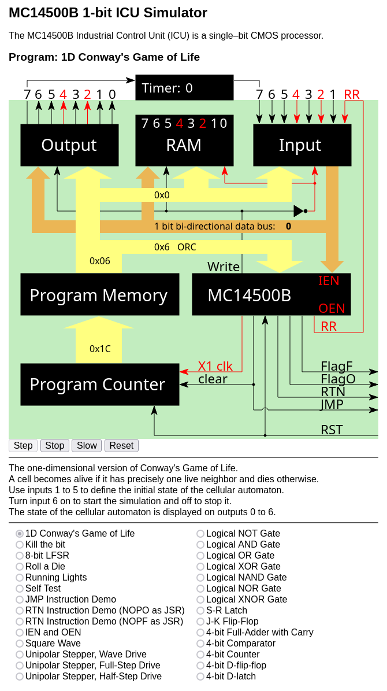

# MC14500 Projects

- [MC14500 Resources](#mc14500-resources)

- [MC14500 Assembler and Disassembler](./mc14500-asm/)

- [MC14500 Simulator](./mc14500-sim/)

- [MC14500 Demo Programs](#mc14500-demo-programs)

- [My programs for Erturk Kocalar's RetroShield 14500](#my-programs-for-erturk-kocalars-retroshield-14500)

- `github.io` [docs](https://dmalenic.github.io/mc14500b/).

The MC14500 is an Industrial Control Unit (ICU) that is also considered to be a 1-bit processor. Motorola produced it,
but the production has been stopped years ago.

## MC14500 Resources

The following related resources were available on 2024-10-21 and may not be available when you read this:

- [MC14500B Datasheet](https://bitsavers.org/components/motorola/14500/MC14500B_Rev3.pdf),

- [MC14500B Industrial Control Unit Handbook](https://bitsavers.org/components/motorola/14500/MC14500B_Industrial_Control_Unit_Handbook_1977.pdf), the alternative download location [archive.org](https://web.archive.org/web/20220220062727/http://bitsavers.org/components/motorola/14500/MC14500B_Industrial_Control_Unit_Handbook_1977.pdf),

- 1978 [Motorola CMOS Integrated Circuits](https://bitsavers.org/components/motorola/_dataBooks/1978_Motorola_CMOS_Data_Book.pdf) Data Book page 358,

- [US Patent 4,153,942](https://patentimages.storage.googleapis.com/4e/ea/42/0ecdf6ebef6592/US4153942.pdf) is Motorola's patent for an industrial control processor that describes MC14500 B's
  internal working,

- [MC14500B Wikipedia Article](https://en.wikipedia.org/wiki/Motorola_MC14500B),

- Urs Lindegger's [MC14500B Simulator](https://www.linurs.org/index.html),

- Yaroslav Veremenko's GitHub page [mc14500-programs](https://github.com/veremenko-y/mc14500-programs),

- Nicola Cimmino's [PLC-14500](https://github.com/nicolacimmino/PLC-14500) GitHub page. The board is [available on tindie](https://www.tindie.com/products/nicola_cimmino/plc14500-nano-1-bit-single-board-computer-revc/).

- [Erturk Kocalar's](https://8bitforce.com/) `RetroShield 14500 for Arduino Mega`, see Erturk's [GitLab pages](https://gitlab.com/8bitforce) for:

    - [hardware](https://gitlab.com/8bitforce/retroshield-hw/-/tree/master/hardware/k14500b) and.
    - [software](https://gitlab.com/8bitforce/retroshield-arduino/-/tree/master/k14500b).

  The board is available on [tindie](https://www.tindie.com/products/8bitforce/retroshield-14500-for-arduino-mega/)

## MC14500 Demo Programs

All programs come in 2 flavors:

- The assembler version is an appropriate subdirectory of [mc14500-asm/examples/](mc14500-asm/examples).

- The assembler output adopted for a simulator in [mc14500-sim/projects/](mc14500-sim/programs).

Some are ported to Erturk's [RetroShield 14500](#my-programs-for-erturk-kocalars-retroshield-14500) hardware.

The most interesting demo programs are:

### One Dimension Conway's Game of Life

- [Assembler](mc14500-asm/examples/1d-conways-gol/1d-conways-gol.asm)

- [Simulator](mc14500-sim/programs/1d_conways_gol.js)

- [RetroShield 14400B](./8-bit-force/k14500b_1d_conway_gol)

#### Game Rules

- A cell is born if it has precisely one live neighbor.

- A cell dies if it has zero or two live neighbors.

- The world consists of 7 cells (0..6).

- The world is cyclic, i.e., the first cell is a neighbor of the last cell.

- The initial state can be defined by the state of 5 middle cells (1..6). The initial state of the first and the last
  cells is always dead.

#### The Rationale Behind The Choices Described Above

- The physical limitation of the MC14500 system is that it targets only 8 bits of RAM.

- It would be possible to design the program to set the initial state of all seven cells. However, if the initial state
  of one automaton corresponds to any other automaton's internal state, those two automatons are equivalent. It would
  only make a program more complex but not allow new behavior.

- Initial cells are defined in the middle of the world. The emulated world is cyclic, but our perception of the
  visualization is not. This choice does not yield any new behavior but makes the generated states' symmetry more
  apparent to the human eye.

#### Program Description

- The cellular automaton state is represented in RAM locations 0 to 7. The state of the cell is stored in the
  corresponding bit of the scratch RAM location. For example, the state of cell 0 is stored in bit 0 of the scratch RAM,
  the state of cell 1 is stored in bit 1 of the scratch RAM, and so on.

- Inputs 1 to 5 define the initial state. Input 1 sets or clears the RAM location 1; input 2 sets or clears RAM
  location 2, and so on. If the input number is rendered black, its value is 0, and the associated cell is dead.
  If the input number is rendered red, its value is 1, and the associated cell is alive.

- The initial state can be changed by clicking inputs 1 to 5 if input 6 is zero (value 0 means the
  simulation is stopped).

- The initial state is copied to the RAM locations 1 to 5 and the outputs 1 to 5.

- Setting the input 6 to one starts the simulation. The simulation runs until input six is on. Clearing it stops
  the simulation.

- Outputs 0 to 6 show the current state of the cellular automaton. Output 7 is not used and is set to 0.

#### Simulator Instructions

1. Open the [index.html](mc14500-sim/index.html) file in a browser.

   

2. Click the 'Fast' button to run the emulator in the fast mode for better visual effects. The program is too long to
   run in Slow or single-stepping mode. 

3. Click on the 'Run' button to start the program.

   

4. Define the initial state by clicking on inputs 1 to 5. If the input number is red, its value is 1, and the associated
   cell is alive. If the input number is black, its value is 0, and the associated cell is dead. In the example below,
   the initial state is defined as 0010100. Note that input 6 is black, indicating that the simulation is stopped and
   that the initial state can be updated.

   

5. Start the simulation by clicking on the input 6. If it is red, the simulation is running. If it is black, the
   simulation is stopped, and you can change the initial state. In the example below, the current state of the cellular
   automaton is 110011. Note that input six is read, indicating that the simulation is running.

   

   Note: the screen capture, by luck, shows the situation where the previous state is still displayed on the output,
   but RAM already contains the new state.

#### How the Program Works

Beyond the 7 RAM bits required to hold the automaton's current state, three extra bits are needed to calculate
the next state. As we have only 8 bits available, the trick was to make the last two bits of the internal state, which
would typically be held in RAM bits 5 and 6, implicit during the next-state calculation using the following strategy:

- The program is divided into four similar sections:

- A section enables or disables inputs and outputs depending on the state of RAM bits 5 and 6. If it keeps inputs and
  outputs enabled, its code implicitly considers the state of RAM bits 5 and 6 and uses them for temporary storage
  while calculating the new state. RAM 5 and 6 are in the actual new state at the end of the calculation.
  The calculation is marked as performed by setting the RAM bits 7 to 1, indicating the following sections to keep
  their inputs and output disabled.

- Section 1 calculates the next state if RAM bits 5 and 6 are 0.

- Section 2 calculates the next state if RAM bit 5 is 0 and bit 6 is 1.

- Section 3 calculates the next state if RAM bit 5 is 1 and bit 6 is 0.

- Section 4 calculates the next state if RAM bits 5 and 6 are 1.

- For readability purposes, the description of the algorithm for calculating the next state uses the following notation:
    - `a` denotes a state of bit 0.
    - `b` denotes a state of bit 1.
    - `c` denotes a state of bit 2.
    - `d` denotes a state of bit 3.
    - `e` denotes a state of bit 4.
    - `f` denotes a state of bit 5.
    - `g` denotes a state of bit 7.
    - `1` or 0 denotes the constant value in a given RAM bit.
    - A bit's new (changed) state is denoted using `a'`, `b'`, and so on.
    - For example:
        - The sequence `a b c d e b 0 x` is interpreted as `a` in RAM0, `b` in RAM1, `c` in RAM2, `d` in RAM3, `e` in
          RAM4, `b` in RAM5, `0` in RAM6. `x` in RAM7 means `don't care.`
        - The transformation `a'b'c d e c b a -> a'b'c'd e c b a, c'=b^d` is interpreted as the change of the state of c
          in RAM2 to `c'` by EXORing the previous state of `b` in RAM6 with the current state of `d` in RAM3. The
          following illustrates the calculation of the following state for the section 1:
    - The initial state is `a b c d e 0 0 0`. The last `0` (bit 7) indicates that previous sections did not perform
      the calculations.
    - The following are the calculation steps for the section:
      - `a b c d e 0 0 0 -> a b c d e a a a`
      - `a b c d e a a a -> a'b c d e a a a, a'=b^g=b^0=b`
      - `a'b c d e a a a -> a'b c d e b b a`
      - `a'b c d e b b a -> a'b'c d e b b a, b'=a^c`
      - `a'b'c d e b b a -> a'b'c d e c b a`
      - `a'b'c d e c b a -> a'b'c'd e c b a, c'=b^d`
      - `a'b'c'd e c b a -> a'b'c'd e c d a`
      - `a'b'c'd e c d a -> a'b'c'd'e c d a, d'=c^e`
      - `a'b'c'd'e c d a -> a'b'c'd'e e d a`
      - `a'b'c'd'e e d a -> a'b'c'd'e'e d a, e'=d^f=d^0=d`
      - `a'b'c'd'e'e d a -> a'b'c'd'e'f'd a, f'=e^g=e^0=e -> NOOP`
      - `a'b'c'd'e'f'd a -> a'b'c'd'e'f'g'a, g'=f^a=0^a=a`
      - `a'b'c'd'e'f'g'a -> a'b'c'd'e'f'g'1`
    - The final `1` (bit 7) indicates that this section has performed the calculations, and the following sections
      should disable inputs and output to skip the calculations.

- Other sections differ in the 2nd and the last 3 steps.

### Kill the Bit

This program is the port of the `KILLBITS` game for Altair, originally published by Dean McDaniel on May 15, 1975.

Reference:

- [KILLBITS.PRN](https://altairclone.com/downloads/killbits.pdf)

The idea to implement it on the MC14500 came to me after watching the demonstration of the original game on the Altair
8800 replica:

- https://www.youtube.com/watch?v=ZKeiQ8e18QY,

And the following video by Usagi Electric:

- https://www.youtube.com/watch?v=md_cPxVDqeM

The implementation was influenced by Yaroslav Veremenko's:

- https://github.com/veremenko-y/mc14500-programs/blob/main/sbc1/killthebit.s,

And Nicola Cimmino's:

- https://github.com/nicolacimmino/PLC-14500/blob/master/tools/assembler/examples/killthebit.asm.

#### Program Description

The game objective is to kill the rotating bit (outputs `1`-`6`). If you miss the lit bit, another bit turns on, leaving
two bits to destroy. Quickly toggle the correct switch (inputs `1`-`6`) at the right moment. Don't leave the switch in
the `ON` position, or the game will pause until you turn it `OFF`.

- [Assembler](mc14500-asm/examples/killthebit/killthebit.asm)

- [Simulator](mc14500-sim/programs/kill_the_bit.js)

  

### 8-bit LFSR

- [Assembler](mc14500-asm/examples/8-bit-lfsr/8-bit-lfsr.asm)

- [Simulator](mc14500-sim/programs/8_bit_lfsr.js)

This program implements an 8-bit Linear Feedback Shift Register (LFSR) with maximum length feedback using the
polynomial:

```
x^8 + x^6 + x^5 + x^4 + 1
```

#### Rules for Selecting Feedback Polynomial:

- The 'one' in the polynomial corresponds to input to the first bit.
- The powers of polynomial term represent tapped bits, counting from the left, e.g., for the 8-bit shift register, the
  power 8 represents the MSB, and the power 1 represents the LSB.
- An input and output tap always connects the first and last bits.
- The maximum length can only be possible if the number of taps is even and there is no common divisor for all taps.

#### Usage:

- Set inputs `5` to ON, `6` to OFF to load the inputs `1` to `4` into RAM `0` to `3` (the initial values `X0`-`X3`)
- Set inputs `5` and `6` to OFF to load the inputs `1` to `4` into RAM `4` to `7` (the initial values `X4`-`X7`)
- Set input `6` to ON to generate a pseudorandom sequence on output `0`.
- Output `1` is the clock signal. It switches from `0` to `1` when the output `0` value is updated and back from
  `1` to `0` at the beginning of a program cycle.


#### Additional References

- Wikipedia article [Linear-feedback shift register](https://en.wikipedia.org/wiki/Linear-feedback_shift_register).

- Wikipedia article [Maximum length sequence](https://en.wikipedia.org/wiki/Maximum_length_sequence).

- Clive “Max” Maxfield's EE Times Tutorial: Linear Feedback Shift Registers (LFSRs)

    - [Part 1](https://www.eetimes.com/tutorial-linear-feedback-shift-registers-lfsrs-part-1/),

    - [Part 2](https://www.eetimes.com/tutorial-linear-feedback-shift-registers-lfsrs-part-2/),

    - [Part 3](https://www.eetimes.com/tutorial-linear-feedback-shift-registers-lfsrs-part-3/).

### Other Demo Programs

Some of the following demo programs are taken from the [MC14500B Industrial Control Unit Handbook](https://bitsavers.org/components/motorola/14500/MC14500B_Industrial_Control_Unit_Handbook_1977.pdf),
or they are a combination of examples from the book.

Few are adapted from the programs provided with the original Urs Lindegger's [MC14500B Simulator](https://www.linurs.org/index.html).

Others are my original work.

- __Roll a Die__: This program generates a random number between 1 and 6. It is adapted from Urs Lindegger's collection.

    - [Assembler](mc14500-asm/examples/roll-a-die/roll-a-die.asm),

    - [Simulator](mc14500-sim/programs/roll_a_die.js).

    - [RetroShield 14500](./8-bit-force/k14500b_roll_a_die)

- __Running Lights__: This program simulates a running light effect like a Christmas tree decoration. It is adapted from
  Urs Lindegger's collection.

    - [Assembler](mc14500-asm/examples/runninglight/runninglight.asm),

    - [Simulator](mc14500-sim/programs/running_lights.js).

- __Self Test__: A simple program to exercise all emulator parts. Nicola Cimmino's
  program [PLC-14500 Smoketest2](https://github.com/nicolacimmino/PLC-14500/blob/master/tools/assembler/examples/smoketest2.asm) was the inspiration.

    - [Assembler](mc14500-asm/examples/selftest/selftest.asm),

    - [Simulator](mc14500-sim/programs/self_test.js).

- __JMP__ Instruction Demo: This is a simple program that demonstrates, with some additional hardware, a 16-byte ROM as
  a lookup table; it is possible to use `JMP` instruction to implement `GOTO` functionality.

    - [Assembler](mc14500-asm/examples/jmp/jmp.asm),

    - [Simulator](mc14500-sim/programs/jmp.js).

- __RTN__ Instruction Demo: This simple program demonstrates how, using additional hardware, a 16-byte ROM as a
  `JSR` lookup table, and a 16-byte LIFO as a stack, it is possible to implement subroutine calls.

    - [Assembler](mc14500-asm/examples/rtn/rtn_nopo.asm) uses `NOPO` instruction as `JSR`,

    - [Assembler](mc14500-asm/examples/rtn/rtn_nopo.asm) uses `NOPF` instruction as `JSR`,

    - [Assembler](mc14500-asm/examples/rtn/rtn_jsr.asm) shows how `EQU` directive can be used to define the pseudo
      instruction `JSR` and link it to the `NOPO` instruction to make the code more readable,

    - [Simulator](mc14500-sim/programs/rtn_nopo.js) uses `NOPO` instruction as `JSR`,

    - [Simulator](mc14500-sim/programs/rtn_nopf.js) uses `NOPF` instruction as `JSR`.

- __IEN and OEN__: This is a simple program that demonstrates how `IEN` and `OEN` instructions modify the behavior of
  `LD`, `LDC`, `STO`, and `STOC` instructions.

    - [Assembler](mc14500-asm/examples/ien-oen/ien-oen.asm),

    - [Simulator](mc14500-sim/programs/ien_oen.js).

- __Square Wave__: This program generates a square wave on the output OUT4. It is taken from Urs Lindegger's collection.

    - [Assembler](mc14500-asm/examples/square/square.asm),

    - [Simulator](mc14500-sim/programs/square.js).

- __Unipolar Stepper, Wave Drive__: This program drives a unipolar stepper motor using a wave drive:

    - [Assembler - shows rotation in a clockwise direction](mc14500-asm/examples/stepper/cw_wave.asm),

    - [Assembler - shows rotation in a counter-clockwise direction](mc14500-asm/examples/stepper/ccw_wave.asm),

    - [Simulator - shows rotation in a clockwise direction](mc14500-sim/programs/stepper_cw_wave.js).

- __Unipolar Stepper, Full Step Drive__: This program drives a unipolar stepper motor using a full-step drive:

    - [Assembler - shows rotation in a clockwise direction](mc14500-asm/examples/stepper/cw_full_step.asm),

    - [Assembler - shows rotation in a counter-clockwise direction](mc14500-asm/examples/stepper/ccw_full_step.asm),

    - [Simulator - shows rotation in a clockwise direction](mc14500-sim/programs/stepper_cw_full_step.js).

- __Unipolar Stepper, Half Step__: This program drives a unipolar stepper motor using a half-step drive:

    - [Assembler - shows rotation in a clockwise direction](mc14500-asm/examples/stepper/cw_half_step.asm),

    - [Assembler - shows rotation in a counter-clockwise direction](mc14500-asm/examples/stepper/ccw_half_step.asm),

    - [Simulator - shows rotation in a clockwise direction](mc14500-sim/programs/stepper_cw_half_step.js).

- __Convert binary to Gray code__: This program converts 7-bit binary to Gray code.

    - [Assembler](mc14500-asm/examples/gray-code/to-gray.asm)
    - [Simulator](mc14500-sim/programs/to-gray.js)

- __Convert Gray code to binary__: This program converts 7-bit Gray code to binary.

    - [Assembler](mc14500-asm/examples/gray-code/from-gray.asm)

    - [Simulator](mc14500-sim/programs/from-gray.js)

- __Palindrome__: This program tests if binary string is a palindrome.

    - [Assembler](mc14500-asm/examples/palindrome/palindrome.asm)

    - [Simulator](mc14500-sim/programs/palindrome.js)

- __Logical NOT Gate__: This program demonstrates the implementation of the logical NOT gate using MC14500B assembler
  code. It is adapted from MC14500B Industrial Control Unit Handbook.

    - [Assembler](mc14500-asm/examples/not/not.asm),

    - [Simulator](mc14500-sim/programs/not.js).

- __Logical AND Gate__: This program demonstrates the implementation of the logical AND gate using MC14500B assembler
  code. It is adapted from MC14500B Industrial Control Unit Handbook.

    - [Assembler](mc14500-asm/examples/and/and.asm),

    - [Simulator](mc14500-sim/programs/and.js).

- __Logical OR Gate__: This program demonstrates the implementation of the logical OR gate using MC14500B assembler
  code. It is adapted from MC14500B Industrial Control Unit Handbook.

    - [Assembler](mc14500-asm/examples/or/or.asm),

    - [Simulator](mc14500-sim/programs/or.js).

- __Logical XOR Gate__: This program demonstrates the implementation of the logical XOR gate using MC14500B assembler
  code. It is adapted from MC14500B Industrial Control Unit Handbook.

    - [Assembler](mc14500-asm/examples/xor/xor.asm),

    - [Simulator](mc14500-sim/programs/xor.js).

- __Logical NAND Gate__: This program demonstrates the implementation of the logical NAND gate using MC14500B assembler
  code. It is adapted from MC14500B Industrial Control Unit Handbook.

    - [Assembler](mc14500-asm/examples/nand/nand.asm),

    - [Simulator](mc14500-sim/programs/nand.js).

- __Logical NOR Gate__: This program demonstrates the implementation of the logical NOR gate using MC14500B assembler
  code. It is adapted from MC14500B Industrial Control Unit Handbook.

    - [Assembler](mc14500-asm/examples/nor/nor.asm),

    - [Simulator](mc14500-sim/programs/nor.js).

- __Logical XNOR Gate__: This program demonstrates the implementation of the logical XNOR gate using MC14500B assembler
  code. It is adapted from MC14500B Industrial Control Unit Handbook.

    - [Assembler](mc14500-asm/examples/xnor/xnor.asm),

    - [Simulator](mc14500-sim/programs/xnor.js).

- __S-R Latch__: This program demonstrates the implementation of the S-R Latch gate using MC14500B assembler code. It is
  adapted from MC14500B Industrial Control Unit Handbook.

    - [Assembler](mc14500-asm/examples/latch/1-bit-sr-latch.asm),

    - [Simulator](mc14500-sim/programs/1_bit_sr_latch.js).

- __J-K Flip-Flop__: This program demonstrates the implementation of the J-K Flip-Flop gate using MC14500B assembler
  code. It is adapted from MC14500B Industrial Control Unit Handbook.

    - [Assembler](mc14500-asm/examples/latch/1-bit-jk-flip-flop.asm),

    - [Simulator](mc14500-sim/programs/1_bit_jk_flip_flop.js).

- __4-bit Full Adder with Carry__: This program demonstrates the implementation of the 4-bit full-adder with carry
  circuit using MC14500B assembler code. It combines several sample routines from the MC14500B Industrial Control Unit
  Handbook into a sample program.

    - [Assembler](mc14500-asm/examples/4-bit-adder/4-bit-adder.asm),

    - [Simulator](mc14500-sim/programs/4_bit_adder.js).

- __4-bit Comparator__: This program demonstrates the implementation of the 4-bit Comparator circuit using MC14500B
  assembler code. It combines several sample routines from the MC14500B Industrial Control Unit Handbook into a sample
  program.

    - [Assembler](mc14500-asm/examples/4-bit-comparator/4-bit-comparator.asm),

    - [Simulator](mc14500-sim/programs/4_bit_comparator.js).

- __4-bit Counter__: This program demonstrates the implementation of the 4-bit Counter circuit using MC14500B assembler
  code.

    - [Assembler](mc14500-asm/examples/4-bit-counter/4-bit-counter.asm),

    - [Simulator](mc14500-sim/programs/4_bit_counter.js).

- __4-bit D-Flip-Flop__: This program simulates a 4-bit D-flip-flop circuit using MC14500B assembler code.

    - [Assembler](mc14500-asm/examples/latch/4-bit-latch.asm),

    - [Simulator](mc14500-sim/programs/4_bit_counter.js).

- __4-bit D-Latch__: This program simulates a 4-bit D-latch circuit using MC14500B assembler code.

  For a discussion of the difference between a flip-flop and a latch, please check this Wikipedia resource, 
  [Flip-flop (electronics)](https://en.wikipedia.org/wiki/Flip-flop_(electronics)). Generally, modern authors
  reserve the term flip-flop exclusively for edge-triggered storage elements and latches for level-triggered ones.

  When a level-triggered latch is enabled, it becomes transparent, but an edge-triggered flip-flop's output only
  changes on a clock edge (either positive or negative going).

    - [Assembler](mc14500-asm/examples/latch/4-bit-d-flip-flop.asm),

    - [Simulator](mc14500-sim/programs/4_bit_d_flip_flop.js).

- __MIF parser tests__ - tests used while developing the MIF parser for [mc14500dis.py](mc14500-asm/mc14500dis.py).

    - [Assembler](mc14500-asm/examples/mif-parser-test)

- __ORG and EQU tests__ - tests to validate if the [mc14500.py](mc14500-asm/mc14500.py) assembler is processing `ORG` and `EQU` directives 
  correctly.

    - [Assembler](mc14500-asm/examples/org_and_equ_tests)

## My Programs for Erturk Kocalar's RetroShield 14500

I have [ported](./8-bit-force/) a few demo programs to Erturk Kocalar's [RetroShield 14500 for Arduino Mega](https://gitlab.com/8bitforce/retroshield-hw/-/tree/master/hardware/k14500b)
that is available on [tindie](https://www.tindie.com/products/8bitforce/retroshield-14500-for-arduino-mega/).

- [1D Conway's Game of Life](./8-bit-force/k14500b_1d_conway_gol) is the port of [One Dimension Conway's Game of Life](#one-dimension-conways-game-of-life).

- [Roll a Die](./8-bit-force/k14500b_roll_a_die) is another port of a [demo program](#other-demo-programs).

- [Stick 'n Rudder](./8-bit-force/k14500b_stick_n_rudder) is example how to contol the real hardware using MC14500B.

See [Erturk's GitLab page](https://gitlab.com/8bitforce/retroshield-arduino/-/tree/master/k14500b) for more programs.
